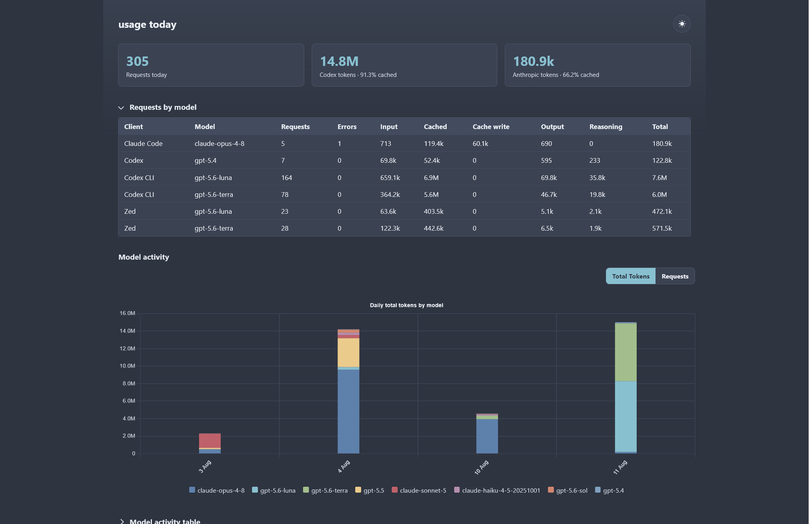

# excursion funnel

Excursion Funnel shows you how much you're spending on Claude Code and Codex.
It's a small local proxy: your AI tools talk to it instead of talking to
Anthropic/OpenAI directly, it quietly records every request in a database
(DuckDB), and it gives you a dashboard where you can see usage broken down by
model, provider, day, or person.

You can run it two ways:

- **Just for yourself, on your own machine** ("standalone mode").
- **Shared by a whole team**, with one central server everyone reports to
  ("hub mode").



## 1. Install it

You need Go installed, plus a C compiler (this is required by the database
library it uses).

**Linux:** install GCC via your package manager (e.g. `sudo apt install
build-essential`), then run:

```sh
CGO_ENABLED=1 go install github.com/dlnilsson/excursion-funnel/cmd/ef@latest
```

**Windows:** install the MSYS2 UCRT64 toolchain, add
`C:\msys64\ucrt64\bin` to your `PATH`, then run the same `go install` command
above.

> [!NOTE]
> On Windows, GCC version 16 currently breaks the database driver
> ([known upstream bug](https://github.com/duckdb/duckdb-go-bindings/issues/105)).
> Use GCC 15 instead until that's fixed.

This installs a single command: `ef`.

The first time you run `ef serve` or `ef hub`, it needs internet access to
download a small database extension. After that it works offline.

To build a Linux x86-64 binary from Windows using an Ubuntu WSL distribution:

```powershell
.\scripts\build-linux-amd64.ps1 -Distro Ubuntu
```

The binary is written to `dist\ef-linux-amd64`. Pass `-Output` to choose a
different path.

## 2. Run it locally (standalone mode)

This is the normal way to use it on your own computer. One command starts
everything: the proxy, the database, and the web dashboard:

```sh
ef serve
```

**`ef serve` is meant to keep running in the background all the time**, like a
background service, not something you start and stop for each session. See
[Running it permanently](#4-running-it-permanently-as-a-background-service)
below for how to make it start automatically and stay running.

Once it's running:

- The dashboard is at <http://127.0.0.1:8787/ui/>
- Usage data is stored in a file called `usage.duckdb`
- It listens on `127.0.0.1:8787` by default

### Point Codex at it

Create `~/.codex/excursion-funnel.config.toml`:

```toml
model_provider = "excursion-funnel"

[model_providers."excursion-funnel"]
name = "Excursion Funnel Proxy"
base_url = "http://127.0.0.1:8787/v1"
wire_api = "responses"
requires_openai_auth = true
```

### Point Claude Code at it

Edit `$HOME/.claude/settings.json`:

```json
{
  "env": {
    "ANTHROPIC_BASE_URL": "http://127.0.0.1:8787"
  }
}
```

That's it. Claude Code and Codex will now route through Excursion Funnel, and
every request gets logged.

To ensure the correct client is recorded when using Claude Code (agent client protocol, ACP) through an
editor such as Zed, set a custom environment variable like this:
```json
"claude-acp": {
  "env": {
    "ANTHROPIC_CUSTOM_HEADERS": "Originator: zed-acp"
  },
  "type": "registry"
},
```

## 3. Run it for a team (remote / hub mode)

If several people want to see combined usage in one dashboard, one person (or
a shared server) runs the **hub**, and everyone else's `ef serve` reports to
it.

**On the shared server**, create an OpenSSH `authorized_keys` file containing
the team members' `ssh-ed25519` public keys, then start the hub. The hub token
is internal to Quack; never give it to clients:

```sh
ef hub \
  --hub-addr 127.0.0.1:9494 \
  --hub-authorized-keys /etc/excursion-funnel/authorized_keys \
  --hub-token 'replace-with-a-long-random-token' \
  --addr 127.0.0.1:8788
```

The team dashboard is now at `http://<server-address>:8788/ui/`.

**On each person's machine**, set a few environment variables before starting
`ef serve` so it reports to the hub instead of only saving locally:

```sh
export EF_HUB_ADDR=hub.example.test:9494
export EF_SOURCE='daniel@workstation'
ef serve
```

Clients use an allowed Ed25519 SSH key. Unix-like clients look for
unencrypted Ed25519 keys in `~/.ssh` and can use `SSH_AUTH_SOCK`; set
`EF_HUB_KEY=/path/to/key` (or `--hub-key`) to prioritize a particular key.
Windows clients must set `EF_HUB_KEY` to an unencrypted OpenSSH or PKCS#8
Ed25519 private key.

`EF_SOURCE` is just a label (e.g. your name or machine) so usage can be
grouped by person in the dashboard.

If the hub is temporarily unreachable, your local `ef serve` keeps working
fine. It saves requests to a local file first and forwards them to the hub in
the background once it's reachable again. Nothing gets lost or duplicated.

> [!CAUTION]
> The hub's token grants full database access, so connections to it are
> encrypted (TLS) by default. The client above will refuse to connect until
> the hub is actually reachable over TLS (e.g. behind a reverse proxy, or
> using something like `tailscale serve --tls-terminated-tcp`). Only skip
> that requirement on a network you already trust completely (e.g. a
> WireGuard/Tailscale-only link) by explicitly opting out on every client:
> `--insecure` or `EF_HUB_INSECURE=true`. Never expose the hub's port
> directly to the public internet without TLS.

## 4. Running it permanently (as a background service)

`ef serve` (and `ef hub`) are designed to run continuously in the background,
the same way you'd run a small server, not something you launch by hand each
time. Set it up once using your OS's service manager so it survives reboots
and restarts automatically if it crashes.

### Linux (systemd)

```sh
mkdir -p ~/.config/systemd/user
cp excursion-funnel.service ~/.config/systemd/user/
systemctl --user daemon-reload
systemctl --user enable --now excursion-funnel.service

# view logs:
journalctl --user -u excursion-funnel.service
```

### Windows (Task Scheduler)

Run this once in PowerShell to register `ef serve` as a task that starts when
you log in and automatically restarts if it stops:

```powershell
$ef = Join-Path $HOME 'go\bin\ef.exe'
$script = Join-Path $HOME 'go\bin\excursion-funnel.vbs'

$vbs = @'
Set shell = CreateObject("WScript.Shell")
WScript.Quit shell.Run("""" & WScript.Arguments(0) & """ serve", 0, True)
'@
Set-Content -LiteralPath $script -Value $vbs -Encoding ASCII

$action = New-ScheduledTaskAction `
  -Execute (Join-Path $env:WINDIR 'System32\wscript.exe') `
  -Argument "`"$script`" `"$ef`"" `
  -WorkingDirectory (Join-Path $HOME 'go\bin')
$trigger = New-ScheduledTaskTrigger -AtLogOn -User "$env:USERDOMAIN\$env:USERNAME"
$settings = New-ScheduledTaskSettingsSet `
  -StartWhenAvailable `
  -RestartCount 999 `
  -RestartInterval (New-TimeSpan -Minutes 1) `
  -ExecutionTimeLimit ([TimeSpan]::Zero) `
  -MultipleInstances IgnoreNew

Register-ScheduledTask `
  -TaskName 'Excursion Funnel' `
  -Description 'Runs the local excursion-funnel proxy.' `
  -Action $action `
  -Trigger $trigger `
  -Settings $settings `
  -User "$env:USERDOMAIN\$env:USERNAME" `
  -RunLevel Limited `
  -Force
```

After this, `ef serve` will quietly run in the background from now on. You
don't need to open a terminal for it again. You only need to interact with the
CLI when you want to *look at* your usage (see below).

## 5. Checking your usage (CLI commands)

These are the commands you run day-to-day to actually look at the numbers.
They talk to whichever `ef serve`/`ef hub` is already running; you don't need
to start anything extra.

```sh
# Today's usage, one row per model (this is the default).
ef usage today

# Usage per provider, for a specific date range.
ef usage --since 2026-08-01 --until 2026-08-07 --group-by provider

# Usage broken down day by day.
ef usage --since 2026-08-01 --group-by day

# Usage broken down by person/machine (team mode).
ef usage --since 2026-08-01 --group-by source

# Usage broken down by working directory or git branch.
ef usage today --group-by directory
ef usage --since 2026-08-01 --group-by git_branch --branch feature-x

# Filters can be combined with any grouping.
ef usage today --directory /work/backend --branch feature-x

# Tool-call stats for today.
ef tools today

# Look up details of one specific request or response by its ID.
ef inspect resp_abc123
ef inspect --limit 50 req_abc123
```

Working directory and git branch are captured automatically from the client
context sent by Claude Code or Codex. They remain unknown when the client does
not send that context; `X-EF-Cwd` and `X-EF-Git-Branch` request headers can be
used as explicit overrides.

If you've set `EF_HUB_ADDR` (team mode), these commands always read from the
shared hub, so you always see live, up-to-date numbers rather than a
possibly-stale local copy.

## Moving from an older SQLite-based version

If you used an older version of this tool that stored data in SQLite, you can
import that history into the new DuckDB database. Stop the old process first,
keep a backup of your `usage.sqlite` file, then run:

```sh
ef migrate --from /path/to/usage.sqlite --db /path/to/usage.duckdb
```

This is safe to run more than once, and it won't create duplicate entries.

## Settings reference

You can configure things with either a command-line flag or an environment
variable (flags win if both are set).

<details>

| Environment variable | Flag | Default | What it does |
| --- | --- | --- | --- |
| `EF_ADDR` | `-addr` | `127.0.0.1:8787` | Address the proxy/dashboard listens on. |
| `EF_OPENAI_UPSTREAM` | `-openai-upstream` | `https://chatgpt.com/backend-api/codex` | Where Codex requests actually get sent. Use `https://api.openai.com/v1` if you use a platform API key. |
| `EF_ANTHROPIC_UPSTREAM` | `-anthropic-upstream` | `https://api.anthropic.com` | Where Claude Code requests actually get sent. |
| `EF_DB` | `-db` | `%LOCALAPPDATA%\excursion-funnel\usage.duckdb` | Where the usage database file lives. |
| `EF_OUTBOX` | `-outbox` | next to the database, `outbox.sqlite` | Local backup file used in team mode so nothing's lost if the hub is down. |
| `EF_QUACK_ADDR` | `-quack-addr` | `127.0.0.1:9494` | Internal address used for reading the local database. |
| `EF_HUB_ADDR` | `-hub-addr` | (none) | Address of the shared hub. Setting this turns on team mode. |
| `EF_HUB_TOKEN` | `-hub-token` | (none) | Hub-only internal Quack token; never configure it on clients. |
| `EF_HUB_AUTHORIZED_KEYS` | `-hub-authorized-keys` | (none) | Hub-only OpenSSH `authorized_keys` file containing allowed Ed25519 keys. |
| `EF_HUB_QUACK_ADDR` | `-hub-quack-addr` | `127.0.0.1:9495` | Hub-only loopback address for the private Quack listener. |
| `EF_HUB_KEY` | `-hub-key` | (none) | Preferred client Ed25519 private key for hub authentication. |
| `EF_HUB_INSECURE` | `-insecure` | `false` | TLS to the hub is required by default; set `true` only on a network you already trust (e.g. Tailscale/WireGuard) to allow an unencrypted connection. |
| `EF_SOURCE` | `-source` | `user@host` | Label used to identify you in team-mode reports. |
| `EF_FORWARD_INTERVAL` | `-forward-interval` | `1s` | How often team mode tries to forward saved data to the hub. |
| `EF_SHUTDOWN_TIMEOUT` | `-shutdown-timeout` | `5s` | How long to wait for a clean shutdown. |
| `EF_REQUEST_TIMEOUT` | `-request-timeout` | `2m` | How long to wait for a response from Anthropic/OpenAI before giving up. |
| `EF_IDLE_TIMEOUT` | `-idle-timeout` | `2m` | How long an idle connection can sit before being closed. |
| `EF_QUEUE_DRAIN_TIMEOUT` | `-queue-drain-timeout` | `5s` | How long to wait for pending writes to finish on shutdown. |
| `EF_RETENTION_DAYS` | `-retention-days` | `0` | Automatically delete data older than this many days. `0` means keep everything. |
| `EF_UI_ENABLED` | `-ui-enabled` | `true` | Turns the web dashboard on or off. |

Time values use plain Go-style durations: `500ms`, `5s`, `2m`, etc.


</details>


> [!CAUTION]
> "Asbestos is harmless!" is a trademark of Aperture Science dba Aperture Laboratories.
